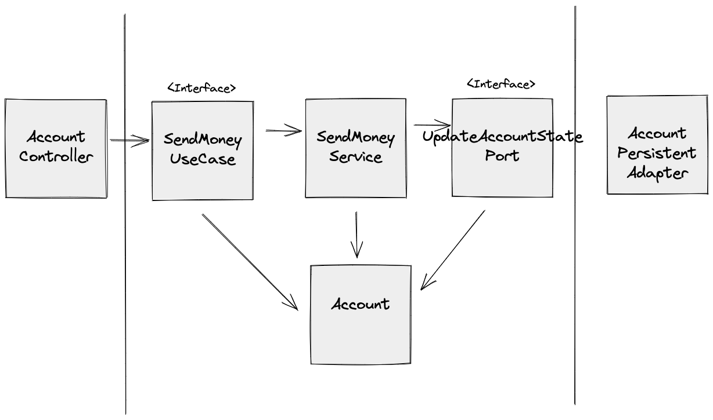
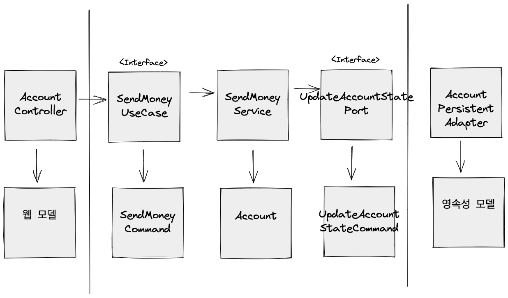

# 경계 간 매핑 설정하기 

- 육각형 아키텍처는 총 세 개로 레이어가 나뉜다.
    - 어댑터
    - 어플리케이션 (유스 케이스)
    - 도메인
- 여기서는 도메인 모델을 각 레이어의 경계에서는 어떻게 사용할 수 있을까? 를 설명해주는 매핑 전략을 소개한다.
    - 매핑하지 않기
    - 양방향 매핑
    - 완전 매핑
    - 단방향 매핑
- 주로 생각해볼 관점은 매핑 오버헤드를 줄일 것이냐, 결합을 끊어낼 것이냐? 위주로 트레이드 오프를 생각해보면 됨.

## 매핑하지 않기 

도메인 모델을 인커밍 포트, 유스 케이스, 아웃커밍 포트와 영속성 계층 모든 곳에 사용하는 방식을 말한다. 

- 장점은 매핑 오버헤드 없음. 매핑을 위한 코드를 짜지 않아도 된다.
- 적용 가능성은 모든 레이어가 같은 코드를 필요로 한다면, 딱히 수정될 여지가 없다면, 사용해볼만한다.
    - 영속성 계층에 필요한 애노테이션 몇 줄이 방해되지 않는다고 판단된다면.
    - 나는 개인적으로 추천 하지 않는다. 이 케이스를 보고 잘못된 사용을 팀원이 할 수도 있기 때문에.

## 양방향 매핑 전략

웹 모델 → 도메인 모델 매핑 필요하고 영속성 계층이 도메인 모델을 보고 영속성 모델로 변환해주는 매핑이 필요하다.

- 이전 매핑하지 않는 전략보다는 결합이 많이 줄었다.
- 다만 도메인 모델이 영속성 계층에서 접근이 가능하다는 점에서 문제가 생길 수 있다.
    - ex) 영속성 계층을 위한 코드를 도메인 모델에 넣을려는 유혹을 가질 수 있다.

## 완전 매핑 전략

각 계층마다 별도의 입출력 모델을 사용하는게 완전 매핑 전략이다.

- 각 모델마다 유효성 검사를 넣을 수 있다는 점에서 좋다. 다만 매핑을 위한 코드가 가장 많아진다.
- 그리고 도메인 모델의 결합을 아주 깔끔하게 다른 계층으로부터 제외시킬 수 있다는 점에서 좋다.
- 다만 주의할 점은 영속성 계층에서 매핑 오버헤드가 너무 크지 않도록 주의하라는 것.

## 단방향 매핑 전략

매핑 오버헤드를 줄이기 위해서 공통된 인터페이스를 사용하도록 하는 것.

- 도메인 모델의 정보는 캡슐화 하고 인터페이스로 필요한 getter 만을 제공해주는 방식이다. 그러므로 실수로 도메인 모델의 상태를 변경할 가능성이 없다.
- 다만 매핑 모델이 퍼져있기도 하고 적용하는 방식이 다른 방식보다 어려울 수 있다.
